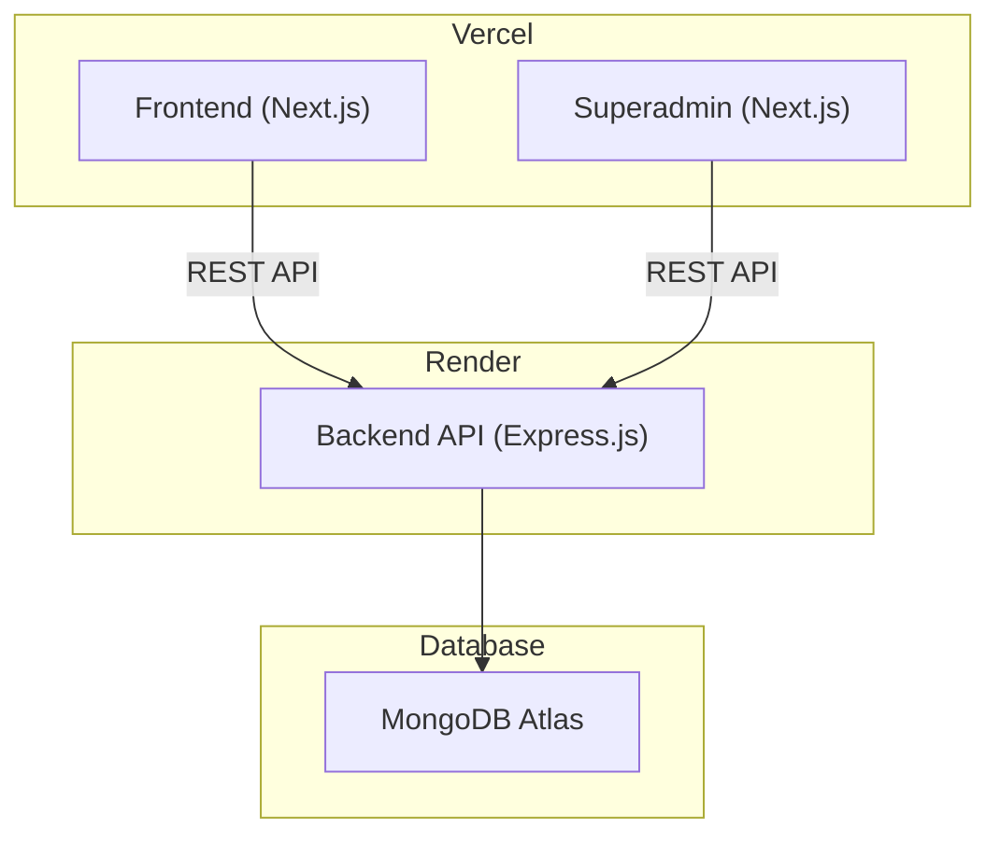
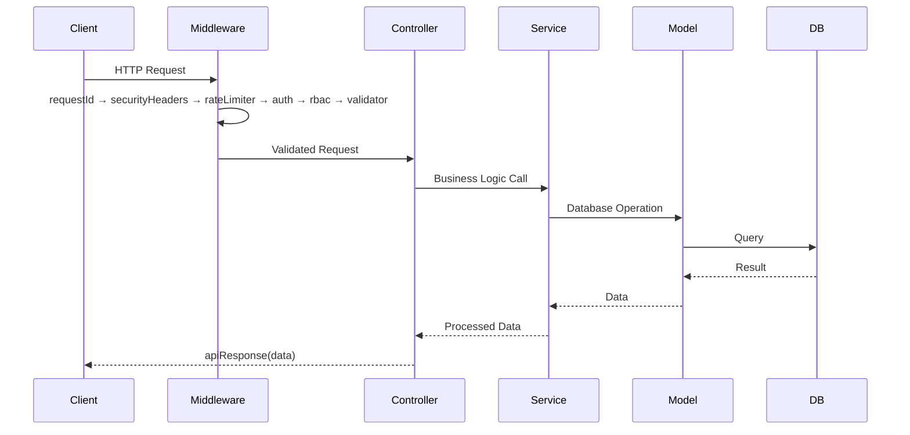

# IG-App — System Architecture

> **Last Updated**: 2026-08-07
> This is a living document. Update it with every architectural change.

---

## 1. System Overview

IG-App is a multi-tenant SaaS platform consisting of three independently deployable applications sharing a common backend API.



---

## 2. Applications

| App | Tech Stack | Deployment | Port (Dev) | Purpose |
|-----|-----------|-----------|------------|---------|
| **frontend** | Next.js 16, React 19, TypeScript, Tailwind CSS 4 | Vercel | 3000 | Customer-facing app |
| **superadmin** | Next.js 16, React 19, TypeScript, Tailwind CSS 4 | Vercel | 3001 | Internal admin panel |
| **backend** | Express.js 5, TypeScript, Mongoose 9 | Render | 5000 | REST API server |

---

## 3. Backend Architecture

### 3.1 Folder Structure

```
backend/src/
├── config/          → Environment, DB, CORS, Logger configuration
├── modules/         → Feature modules (self-contained business logic)
│   ├── auth/        → Authentication (login, register, token refresh)
│   ├── user/        → User CRUD operations
│   └── tenant/      → Multi-tenant management
├── middleware/       → Express middleware (auth, RBAC, validation, errors)
├── shared/          → Shared utilities, types, constants, error classes
├── app.ts           → Express app setup (middleware + routes, no listen)
└── server.ts        → Server entry (listen + graceful shutdown)
```

### 3.2 Module Pattern

Each module follows the same structure:
```
modules/<name>/
├── <name>.controller.ts   → Route handlers (req/res logic)
├── <name>.service.ts      → Business logic (DB queries, computations)
├── <name>.model.ts        → Mongoose schema/model (if applicable)
├── <name>.routes.ts       → Express router with validation middleware
├── <name>.validation.ts   → Zod schemas for request validation
├── <name>.types.ts        → TypeScript interfaces for this module
└── README.md              → Module documentation
```

**Adding a new feature**: Create a new folder in `modules/`, follow the pattern, register routes in `app.ts`.  
**Removing a feature**: Delete the folder, remove route import from `app.ts`.

### 3.3 Request Lifecycle



### 3.4 Security Layers

| Layer | Tool | Purpose |
|-------|------|---------|
| Headers | Helmet | OWASP security headers |
| Rate Limiting | express-rate-limit | Prevent abuse (100 req/15min) |
| CORS | cors + whitelist | Only allow known frontends |
| Auth | JWT (jsonwebtoken) | Stateless authentication |
| Authorization | RBAC middleware | Role-based access control |
| Validation | Zod | Input sanitization + type safety |
| Passwords | bcryptjs | Secure password hashing |
| Request Tracking | uuid | Unique ID per request for debugging |

---

## 4. Frontend Architecture

### 4.1 Folder Structure

```
frontend/src/
├── app/                  → Next.js App Router pages
│   ├── (auth)/           → Login/Register (no sidebar)
│   ├── (dashboard)/      → Protected pages (with sidebar)
│   ├── layout.tsx        → Root layout
│   └── globals.css       → Global styles
├── components/           → Reusable UI components
│   ├── ui/               → Primitives (Button, Input, Modal)
│   ├── layout/           → Header, Sidebar, Footer
│   └── shared/           → Cross-feature components
├── lib/                  → Core utilities
│   ├── api.ts            → API client with auth token injection
│   ├── auth.ts           → Token management
│   ├── constants.ts      → App constants
│   └── utils.ts          → General utilities
├── hooks/                → Custom React hooks
├── providers/            → Context providers (Auth, Theme)
├── types/                → TypeScript definitions
└── styles/               → Additional CSS
```

---

## 5. API Endpoint Reference

> Update this table when adding/modifying endpoints.

### Auth Module
| Method | Path | Auth | Description |
|--------|------|------|-------------|
| POST | `/api/auth/register` | ✗ | Register new user |
| POST | `/api/auth/login` | ✗ | Login, returns JWT |
| POST | `/api/auth/refresh` | ✓ | Refresh access token |
| POST | `/api/auth/logout` | ✓ | Invalidate refresh token |

### User Module
| Method | Path | Auth | Description |
|--------|------|------|-------------|
| GET | `/api/users/me` | ✓ | Get current user profile |
| PUT | `/api/users/me` | ✓ | Update current user profile |
| GET | `/api/users` | ✓ (Admin) | List all users |
| GET | `/api/users/:id` | ✓ (Admin) | Get user by ID |

### Tenant Module
| Method | Path | Auth | Description |
|--------|------|------|-------------|
| GET | `/api/tenants` | ✓ (SuperAdmin) | List all tenants |
| POST | `/api/tenants` | ✓ (SuperAdmin) | Create tenant |
| GET | `/api/tenants/:id` | ✓ (SuperAdmin) | Get tenant |
| PUT | `/api/tenants/:id` | ✓ (SuperAdmin) | Update tenant |
| DELETE | `/api/tenants/:id` | ✓ (SuperAdmin) | Delete tenant |

---

## 6. Database Schema

### Users Collection
```typescript
{
  _id: ObjectId,
  email: string (unique, indexed),
  password: string (bcrypt hashed),
  firstName: string,
  lastName: string,
  role: 'superadmin' | 'admin' | 'user',
  tenantId: ObjectId (ref: Tenant),
  isActive: boolean,
  lastLogin: Date,
  createdAt: Date,
  updatedAt: Date
}
```

### Tenants Collection
```typescript
{
  _id: ObjectId,
  name: string,
  slug: string (unique, indexed),
  domain: string,
  plan: 'free' | 'starter' | 'pro' | 'enterprise',
  isActive: boolean,
  settings: {
    maxUsers: number,
    features: string[]
  },
  createdAt: Date,
  updatedAt: Date
}
```

---

## 7. Deployment

### Backend (Render)
- **Service**: Web Service
- **Runtime**: Docker (Node.js 20 Alpine)
- **Health Check**: `GET /health`
- **Environment**: Set via Render Dashboard
- **Auto-deploy**: Push to `main` branch

### Frontend & Superadmin (Vercel)
- **Framework**: Next.js (auto-detected)
- **Build**: `npm run build`
- **Environment**: Set via Vercel Dashboard
- **Domains**: Configure custom domains in Vercel

---

## 8. Environment Variables

See `.env.example` files in each project for required variables.

| Variable | Backend | Frontend | Superadmin |
|----------|---------|----------|------------|
| `PORT` | ✓ | — | — |
| `NODE_ENV` | ✓ | — | — |
| `MONGODB_URI` | ✓ | — | — |
| `JWT_SECRET` | ✓ | — | — |
| `JWT_REFRESH_SECRET` | ✓ | — | — |
| `CORS_ORIGINS` | ✓ | — | — |
| `NEXT_PUBLIC_API_URL` | — | ✓ | ✓ |
